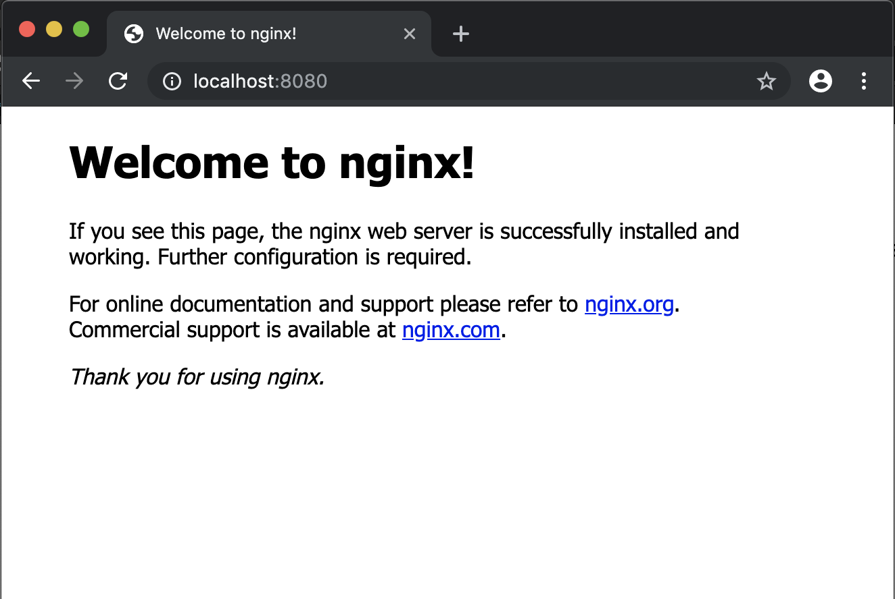

# Dockerを使う

さて、長々しい説明も終わったので実際にDockerを使っていこう。

## Dockerのエディション(Edition)について

- [Docker Enterprise Edition (Docker EE)](https://docs.docker.com/ee/)
- [Docker Community Edition (Docker CE)](https://docs.docker.com/install/)

の2エディションが存在している。EEは企業向けのものなので、私たちが個人で使う分には基本的にDocker CEを使うことになるだろう。

Docker CEは無料で利用できる。

## Dockerをインストールする

インストール方法は本当によく変わるので、英語が読める人は[公式ドキュメント](https://docs.docker.com/install/)を読むのがいいと思う。


あまり私の所有していないプラットフォームでのインストール方法については自信がないので、あえて抽象的な説明にとどめておく。ごめんなさい。わからなかったら気軽にDiscordなどで質問してください。


### macOSの人

1. [ここ](https://hub.docker.com/editions/community/docker-ce-desktop-mac)から、`Docker.dmg`をダウンロードし、中に入っているappをインストールする。
1.1. (なおHomebrew Caskを使っている人は`brew cask install docker`で入る)
2. `Docker.app`を起動し、指示に従う。(パスワードを聞かれたりします)

### Windowsの人

Microsoft Windows 10 64-bitのProfessionalまたはEnterpriseが必要。

1. [ここ](https://hub.docker.com/editions/community/docker-ce-desktop-windows)からインストーラをダウンロードする。
2. インストーラを実行し、指示に従う。
3. インストールが完了したら、`Docker for Windows`を起動し、指示に従う。

なお、Windows 10 64-bit ProfessionalまたはEnterpriseではないWindows(Windows 10 Homeなど)では、[Docker Toolbox](https://docs.docker.com/toolbox/overview/)を使うことでDockerを使用することができる。しかし、個人的には無料のGNU/Linuxに移行するか新しいWindowsをインストールすることをお勧めする。

### GNU/Linuxの人

[CentOS](https://docs.docker.com/install/linux/docker-ce/centos/)、[Debian](https://docs.docker.com/install/linux/docker-ce/debian/)、[Fedora](https://docs.docker.com/install/linux/docker-ce/fedora/)、[Ubuntu](https://docs.docker.com/install/linux/docker-ce/ubuntu/)向けのインストールガイドが公式にあるのでそれを見て、インストールする。

(全部書けないです、ごめんなさい、わからなかったらぜひ質問してください)

## Dockerを使ってみる (Hello World)

```shell
$ docker -v
```

バージョンが出てきたと思う。


GNU/Linuxユーザーで権限がどうとか言われた場合は[これをみて](https://docs.docker.com/install/linux/linux-postinstall/)


ではいよいよHello Worldだ。いざ

```shell
$ docker run hello-world
```

なんか色々英語で出てきたと思う。正常に実行されたならば、以下のようなメッセージが表示されたはずだ。

```
Hello from Docker!
This message shows that your installation appears to be working correctly.

To generate this message, Docker took the following steps:
 1. The Docker client contacted the Docker daemon.
 2. The Docker daemon pulled the "hello-world" image from the Docker Hub.
    (amd64)
 3. The Docker daemon created a new container from that image which runs the
    executable that produces the output you are currently reading.
 4. The Docker daemon streamed that output to the Docker client, which sent it
    to your terminal.

To try something more ambitious, you can run an Ubuntu container with:
 $ docker run -it ubuntu bash

Share images, automate workflows, and more with a free Docker ID:
 https://hub.docker.com/

For more examples and ideas, visit:
 https://docs.docker.com/get-started/
```

🎉

## もうちょっと役に立つことをする

下のコマンドを入力してほしい。

```shell
$ docker run -p 8080:80 nginx
```

なんだかダウンロードが始まるので、しばらく待つ。

下のようなメッセージが表示されたら、ブラウザで[http://localhost:8080](http://localhost:8080)を開いてみよう。

```
Status: Downloaded newer image for nginx:latest
```

ブラウザから、以下のようにnginxが起動している様子が見えると思う。



このように、なんの環境構築をすることもなく、Webサーバーが構築できてしまった。これが先に述べた「環境を共有する」ということだ。
