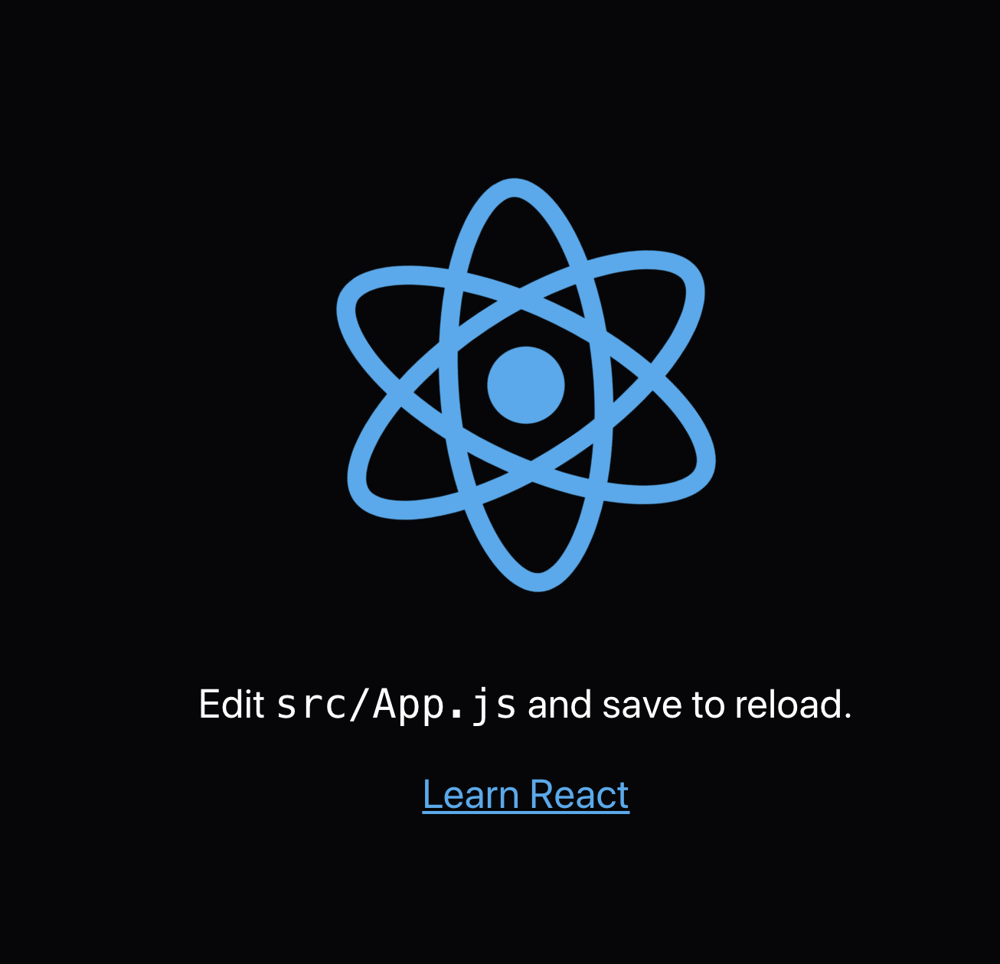

# React.js　入門

あんはるです。

創作展システムでも実際に使われてるReact.jsを教えます。

まず、JavaScriptをかけない人は、この記事を読みましょう。

[JavaScript(ES6) 入門](https://sakuten-wiki.netlify.com/docs/lecture/js-getting-started.html)

## React.jsってなんですか？

JavaScriptで書かれたライブラリです。Webの見た目を表示させるために使われます。

## 早速、React.jsでwebページを表示させましょう

WindowsならPowerShell,MacならTerminalを開きましょう。

まず、create-react-appというのをインストールしましょう。

```shell
npm install -g create-react-app
```

create-react-appで、必要なファイルを作ってくれます。
今回は、`hello-sakuten`という名前で作ってみましょう。

```shell
create-react-app hello-sakuten
```

### サーバーを起動してみよう

```
cd hello-sakuten
npm start
```

http://localhost:3000 にアクセスしてみよう。


このように表示させることができれば、あなたはサーバーを起動させることができました。

`cd hello-sakuten`は、hello-sakutenというフォルダを開くということで、
`npm start`というのはサーバーを起動させるコマンドです。

### なぜ表示されたのだろうか？コードをみてみよう
 ディレクトリ・ファイル構成はこのようになっています。

```shell

 ❯ tree -I node_modules
.
├── README.md
├── package.json
├── public
│   ├── favicon.ico
│   ├── index.html
│   └── manifest.json
├── src
│   ├── App.css
│   ├── App.js
│   ├── App.test.js
│   ├── index.css
│   ├── index.js
│   ├── logo.svg
│   └── serviceWorker.js
└── yarn.lock

2 directories, 13 files

```

`package.json`というのは、使うパッケージ（プログラム）を宣言したり、バージョンを定めたりしています。

`src`ディレクトリは、ソースコードが入っています。


