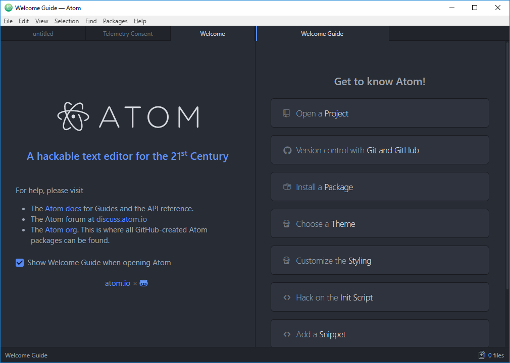
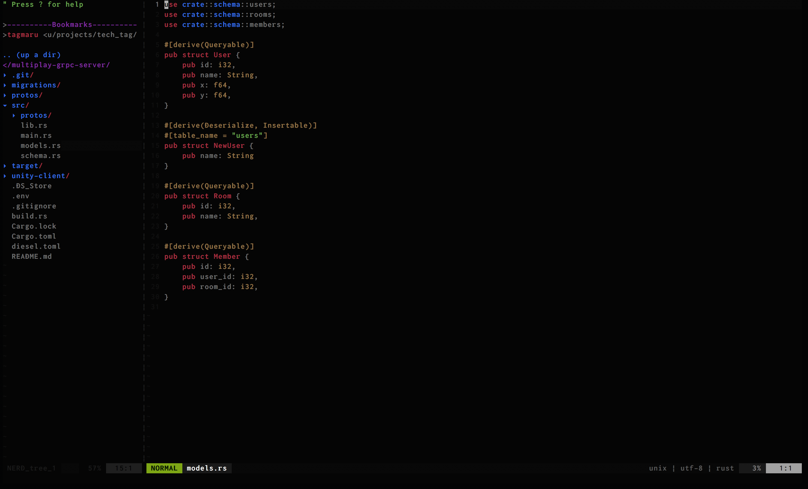
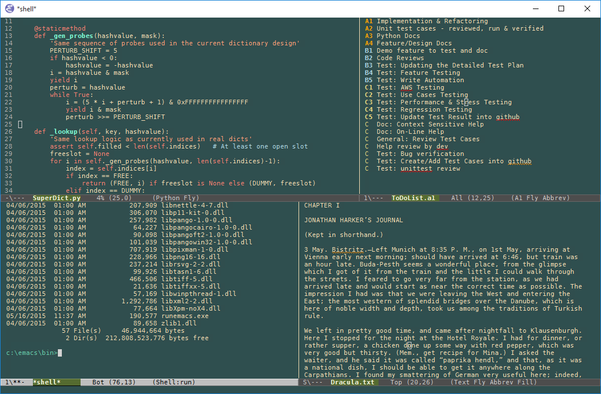
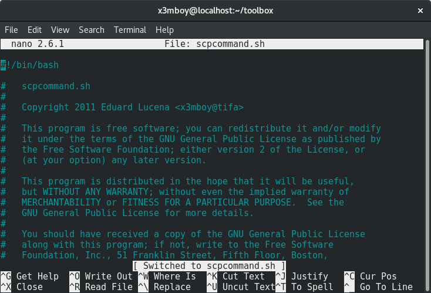

# エディタを選ぼう

あんはるです。プログラミングには欠かせないエディタについて教えます。

## エディタとはなんですか?

プログラムを編集するアプリケーションです。これがないとプログラミングできません。メモ帳、テキストエディットなどOSにデフォルトで入っているエディタもあります。

## エディタは大きく分けて2つに分かれる

GUIエディタとCUIエディタです。

### GUIエディタ
GUI(グラフィカルユーザインタフェース)というのは、普段マウスで操作しているPCの画面のことです。

GUIエディタは、GUI上で動作するエディタです。代表的なものにVisual Studio CodeやAtomがあります。

GUIエディタでも、軽いものや重いもの、シンプルなもの、機能が多いいもの、色々あるので試してみると面白いです。

GUI上で直感的に操作できるので、初心者には使いやすいと思います。

### CUIエディタ
CUI(キャラクタユーザインタフェース)というのは、MacのターミナルやWindowsのコマンドプロンプトやPowerShellの画面のことです。

CUIエディタは、CUI上で動作するエディタです。代表的なものにVimやEmacsがあります。

CUIエディタは操作方法がとても多様なので試してみると面白いです。

プログラミングをしていると、
よくCUIの画面で作業するので、いちいちGUIにいかないでCUIのままでファイルを編集すると効率がいいのではないかと思います。

慣れてくると使いやすく感じるでしょう。

#### 創作展システムの人が使ってるエディタ
ランキングで言えば、
 1. Vim
 2. Visual Studio
 3. Visual Studio Code, Eclipse

私はVimです。

私は、プログラミング始めた頃はSublime Textというのを使っていました。次第に、Vimがいいなぁと思い始めて、今は基本的にVimしか使ってません。
下で紹介します。

## 代表的なエディタの紹介

### GUIエディタ
#### Atom
Githubが開発したエディターです。

雰囲気がオシャレです。機能が多く、プラグインも豊富でしょう。重めです。

https://atom.io/

#### Visual Studio Code
Microsoftが開発したエディタです。

軽めです。

デフォルトでGitと連携できたり、機能は豊富ですね。

https://code.visualstudio.com

#### Sublime Text
軽めで、シンプルなエディタです。

オシャレな感じですね。

プラグインを追加すると色々な機能が使えます。

https://www.sublimetext.com

### CUIエディタ

#### Vim(Vi)
代表的なCUIエディタですね。

Vimはいくつかのモードに分かれていて、コマンド入力モード、文字入力モード、文字選択モードなどがあってそれを切り替えながら作業します。

 プラグインが豊富であり、CUIでもとても使いやすくなるでしょう。

素のVimは機能が最低限なので、自分好みのプラグインを追加して自分だけの特別なエディタにしましょう!

https://www.vim.org

#### Emacs

とても歴史的なエディタですね（Vimもですが）。

EmacsはOSという人もいるほど（OSではないですが）、emacsだけで色々なことが完結できるそうです。

プラグインが豊富であり、拡張性が高いです。

https://www.gnu.org/software/emacs/

#### Nano

VimやEmacsよりも、GUIエディタに操作が似ていて、直感的にわかりやすいでしょう。

調べた限りでは、追加の機能を追加したりなどはあまりできなくVim,Emacsよりは拡張性が低いでしょう。

ある程度の設定はできます。

https://www.nano-editor.org

## まとめ
エディタは、どれが優れているか劣っているかではなく、あなたが使いやすいかです。

あなたが好きなエディタを選んで使って、効率的なコーディングをしていただきたいです。

