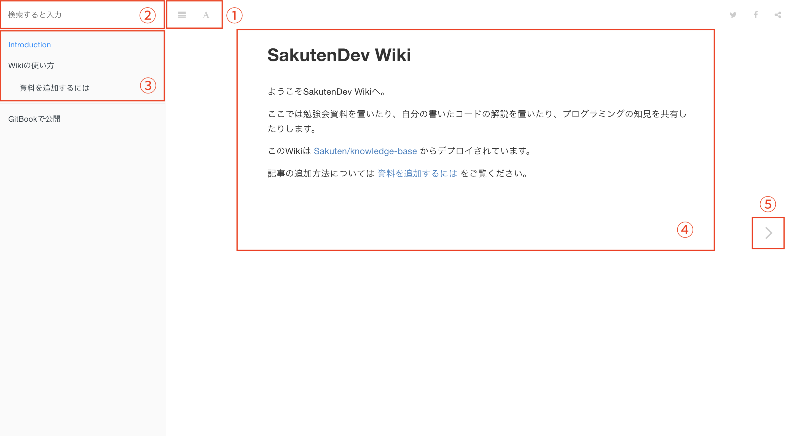

# このWikiの使い方

- （1） 文字サイズ、フォントなど表示をみやすいように調整できます。
- （2） 全文検索ができます
- （3） 記事リストです。項目をクリックすると表示できます
- （4） 内容です
- （5） 次のページに進みます

このWikiは [gitbook](https://www.gitbook.com/) というソフトウェアを用いて構築されています。

基本的には使い方にこまったら`gitbook`で検索すると有益な情報が得られると思います。
